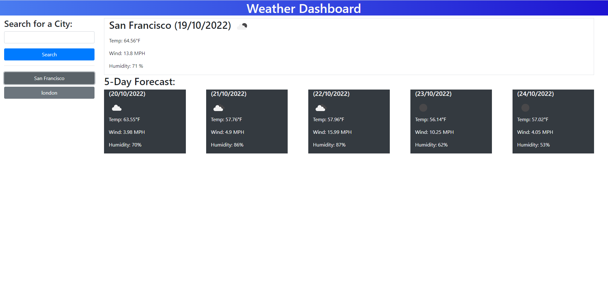

# weather-dashboard

## Description
This website is built to create a weather dashboard by using the the Open Weather website's API. When the users enter the city name, this website demonstrates the weather condition for that city today and the next 5 days. This website also saves the searched cites as buttons so that users are able to see that weather forecast without searching again.

## Website

https://vantam8300.github.io/weather-dashboard/